# Deep Learning for Wind Turbine Operating Mode Classification (CNNs and RNNs)

## Overview
In modern industrial applications, sensor data is used to detect early machine issues and reduce maintenance cost. This project focuses on wind turbines: using two sensor time series (pitch angle and torque) to classify turbine operating mode into 4 classes.

The workflow compares sequence models (RNN-based) and image-based CNN models, then selects and evaluates the best-performing model.

## Repository Contents
- `models.ipynb`: Full experiment notebook (Questions 1-6)
- `model_Max_adjust.h5`: Saved final selected model
- `Paper_Renewable Energy.pdf`: Reference paper used in the project
- `tuner_CNN/`: KerasTuner Hyperband search artifacts
- `assets/graphs/`: Exported training/validation plots from notebook outputs

## Problem Setup
- Input: two time series per observation
- Output: 4-class operating mode label
- Labels were one-hot encoded for softmax classification with `categorical_crossentropy`

## Data Pre-processing
### Sequence-to-Vector framing (RNN path)
The RNN task is framed as sequence-to-vector: the full two-channel sequence is encoded and mapped to a final 4-class output.

### Key pre-processing decisions
- No scaling was applied to the two time series.
- Reasoning used in the notebook:
  - distributions across periods were not significantly different
  - scaling might remove period-specific information useful for classification
- Data was shuffled and split as:
  - Train: 2800 samples (70%)
  - Validation: 600 samples (15%)
  - Test: 600 samples (15%)
- RNN input was stacked as `(samples, time_steps, features)`:
  - train: `(2800, 5000, 2)`
  - validation: `(600, 5000, 2)`
  - test: `(600, 5000, 2)`

### CNN conversion (Scenario 2 style)
For CNN experiments, each observation was converted into a grayscale image:
- each original series reshaped to `(100, 50, 1)`
- concatenated across width (`axis=2`) to form `(100, 100, 1)`
- final CNN tensor shape: `(4000, 100, 100, 1)`
- split with same seed and same 2800/600/600 partition

## Experiments Summary (Notebook Questions)

### Q1: RNN modeling and benchmarking
Compared:
- SimpleRNN
- LSTM
- GRU
- Conv1D + GRU hybrid
- deeper Conv1D + GRU/LSTM variants

Core setup:
- output layer: `Dense(4, activation="softmax")`
- optimizer (most runs): Adam, lr=0.001
- typical run length: 20 epochs

Reported benchmark observations from notebook:
- SimpleRNN (20 epochs): loss `0.6900`, acc `0.7429`, val_loss `0.7184`, val_acc `0.7133`, ~265s/epoch
- LSTM (20 epochs): loss `0.8763`, acc `0.6164`, val_loss `0.9074`, val_acc `0.6067`, ~420s/epoch
- GRU (20 epochs): loss `0.7023`, acc `0.7196`, val_loss `0.7825`, val_acc `0.6833`, ~450s/epoch
- Optimal RNN (`3x Conv1D + GRU(150) + GRU(20)`, 20 epochs):
  - loss `0.1531`
  - acc `0.9307`
  - val_loss `0.3225`
  - val_acc `0.8567`
  - ~74s/epoch

### Q2: Why CNN-style transformation can help
The project notes that convolution can extract local patterns efficiently and reduce input dimensionality. This can improve learning efficiency and reduce the long dependency burden common in pure RNN paths.

### Q3: Convert time series to image format
Implemented conversion into grayscale `(100,100,1)` per sample as specified.

### Q4: Reproduce baseline CNN (three-convolution architecture)
Baseline CNN test result:
- Test loss: `0.2564`
- Test accuracy: `0.8667`

### Q5: Improve CNN
Methods tested:
- KerasTuner Hyperband search
- deeper CNN with additional MaxPooling
- BatchNormalization-enhanced CNN (`model_Max_adjust`)
- transfer learning (MobileNetV1/V2)

Selected CNN variant for final stage:
- `model_Max_adjust` (Conv2D + BatchNorm + MaxPool + Dropout)

### Q6: Compare models and select final
RNN and CNN records were compared in tracking DataFrames (`df_model_record_*`).

Final chosen model: `model_Max_adjust` (CNN).
- retrained on combined train+validation: `x_CNN_evaluate.shape = (3400, 100, 100, 1)`
- evaluated on test set:
  - Test loss: `0.2843`
  - Test accuracy: `0.8767`

Saved model artifact:
- `model_Max_adjust.h5`

## Plots (Preserved)
All notebook graph outputs were exported and retained.

### RNN curves
- SimpleRNN loss curve  
  
- LSTM loss curve  
  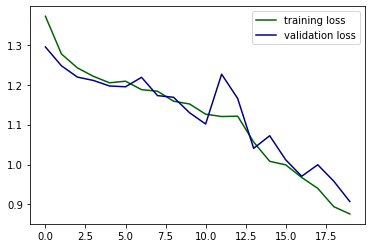
- GRU loss curve  
  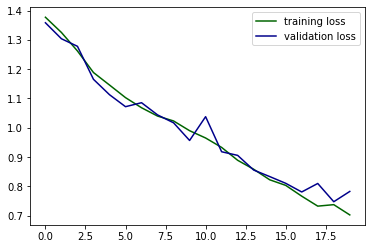
- Conv1D + GRU curve  
  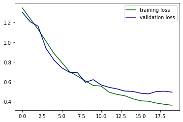
- Optimal RNN (Conv1D x3 + GRU) curve  
  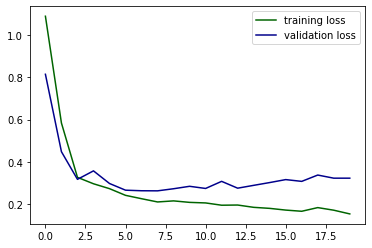
- Optimal RNN-2 (Conv1D x3 + LSTM) curve  
  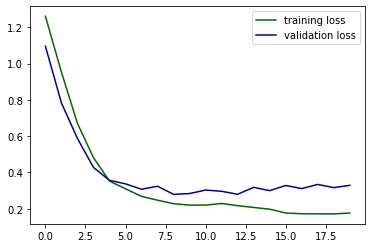

### CNN curves
- Baseline CNN curve  
  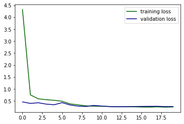
- Tuned CNN (KerasTuner) curve  
  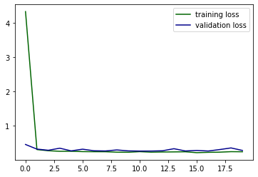
- CNN + extra MaxPooling curve  
  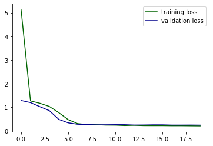
- Final CNN (`model_Max_adjust`) curve  
  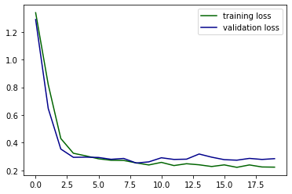
- MobileNetV1 transfer curve  
  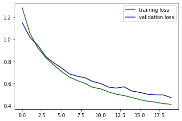
- MobileNetV2 transfer curve  
  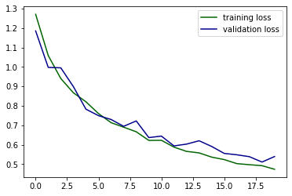

## Reproducibility Notes
The notebook repeatedly clears sessions and fixes seeds (`np.random.seed(231)`, `tf.random.set_seed(631)`) during experiments. Main dependencies used include:
- TensorFlow / Keras
- NumPy
- Pandas
- Matplotlib
- SciPy
- KerasTuner

## Reference
- Renewable energy paper used in this project: `Paper_Renewable Energy.pdf`
